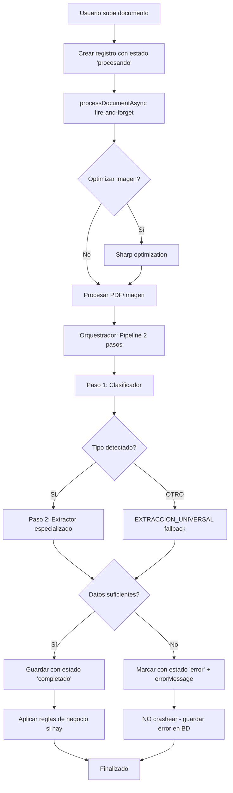

# Contexto Actual del Proyecto - Parse/Rendiciones App

**Última actualización:** 13 de Enero 2025

---

## 🎯 Estado del Sistema

### Funcionando y Probado
- ✅ **Procesamiento de documentos** con pipeline de 2 pasos (clasificador + extractor)
- ✅ **Gestión de prompts GLOBAL** para superadmins
- ✅ **Manejo robusto de errores** - Backend no crashea, mensajes claros al usuario
- ✅ **Optimización de imágenes** con Sharp (reducción 70-90% tamaño)
- ✅ **Reglas de negocio** con múltiples operaciones (LOOKUP, AI_LOOKUP, SET_VALUE, etc.)
- ✅ **Multi-tenancy** completo con aislamiento de datos
- ✅ **Sistema de permisos** por rol (superuser, admin, usuario)

### Últimos Cambios (13 Enero 2025)
1. **Prompts GLOBAL:** Superadmins pueden crear/editar prompts sin tenant (fallback universal)
2. **errorMessage:** Nuevo campo en BD para guardar errores específicos sin eliminar documentos
3. **No más crashes:** Backend maneja errores de procesamiento sin crashear Node.js

---

## 📊 Arquitectura Actual

### Backend (Node.js + Express + Prisma)
```
backend/
├── src/
│   ├── routes/
│   │   ├── documentos.js        ← Procesamiento de docs, MODIFICADO
│   │   ├── prompts.js           ← Gestión prompts GLOBAL, NUEVO
│   │   └── parametros/
│   ├── services/
│   │   ├── documentExtractionOrchestrator.js  ← Pipeline 2 pasos
│   │   ├── classifierService.js               ← Clasificación de docs
│   │   ├── documentProcessor.js               ← OCR y preprocesamiento
│   │   ├── imageOptimizationService.js        ← Sharp optimization
│   │   └── promptManager.js
│   └── lib/
├── prisma/
│   └── schema.prisma            ← Agregado errorMessage
└── uploads/documentos/
```

### Frontend (Next.js 14 + TypeScript)
```
frontend/
├── src/
│   ├── app/(protected)/
│   │   ├── prompts-ia/page.tsx          ← UI prompts GLOBAL, MODIFICADO
│   │   ├── parse/page.tsx
│   │   ├── parametros/page.tsx
│   │   └── sugerencias-ia/page.tsx
│   ├── components/
│   │   ├── shared/
│   │   │   └── DocumentUploadModal.tsx  ← Mostrar errorMessage, MODIFICADO
│   │   ├── parametros/
│   │   │   └── ReglaModal.tsx
│   │   └── rendiciones/
│   │       └── SmartSelector.tsx
│   └── lib/api.ts
```

---

## 🗄️ Base de Datos (PostgreSQL + Prisma)

### Tablas Principales
```sql
-- Documentos procesados
documentos_procesados
  id, nombreArchivo, tipoArchivo, rutaArchivo
  estadoProcesamiento  -- 'procesando' | 'completado' | 'error'
  errorMessage         -- NUEVO: mensaje de error específico
  datosExtraidos (JSON)
  fechaExtraida, importeExtraido, cuitExtraido
  reglasAplicadas, tenantId, usuarioId

-- Líneas de documentos
documento_lineas
  id, documentoId, numero, descripcion
  codigoProducto, codigoProductoOriginal, cantidad, precioUnitario
  codigoDimension, subcuenta, cuentaContable

-- Reglas de negocio
reglas_negocio
  id, codigo, nombre, tipo, prioridad
  condiciones (JSON), acciones (JSON)
  @@unique([codigo, tenantId])

-- Prompts de IA
ai_prompts
  id, clave, nombre, tipo, prompt
  tenantId  -- NULL = GLOBAL, String = tenant específico
  @@unique([clave, tenantId])

-- Parámetros maestros
parametros_maestros
  codigo, nombre, tipo_campo, parametros_json
  @@unique([tipo_campo, codigo, tenantId])
```

---

## 🔑 Flujo de Procesamiento de Documentos



---

## 🎨 UI/UX Importantes

### SmartSelector (Edición Inline)
- Componente para editar campos desde la tabla de documentos
- Autocomplete desde `parametros_maestros`
- Muestra: `codigo - nombre` con truncate + tooltip

### DocumentUploadModal
- Upload múltiple con drag & drop
- Progress bar en tiempo real
- Muestra errores específicos desde `errorMessage`
- Contador: "Procesando comprobante X de Y"

### Prompts IA (Solo Superadmins)
- Badge azul 🌐 para prompts GLOBAL
- Checkbox "Prompt Global" en formulario
- Filtrado automático por tenant (excepto GLOBAL para superadmins)

---

## ⚙️ Variables de Entorno Críticas

### Backend (.env)
```env
PORT=5100
DATABASE_URL=postgresql://...
JWT_SECRET=...
FRONTEND_URL=https://parsedemo.axiomacloud.com

# IA
ENABLE_AI_EXTRACTION=true
ANTHROPIC_API_KEY=...
GEMINI_API_KEY=...
USE_CLAUDE_VISION=true
USE_DOCUMENT_AI=false
```

### Frontend (.env.local)
```env
NEXT_PUBLIC_API_URL=https://api.parsedemo.axiomacloud.com
```

---

## 🐛 Problemas Conocidos y Soluciones

### ❌ Backend crashea al procesar documento
**Estado:** ✅ SOLUCIONADO (13 Enero 2025)
**Solución:** Documentos ahora se marcan como 'error' con mensaje específico

### ❌ Prisma Client desactualizado
**Solución:**
```bash
cd backend
npx prisma generate
```

### ❌ SmartSelector no muestra nombres
**Estado:** ✅ SOLUCIONADO (sesión anterior)
**Solución:** Backend enriquece datos con `enrichDocumentWithParameterNames()`

---

## 📝 Convenciones de Código

### Prompts
- **Clave:** `EXTRACCION_FACTURA_A`, `CLASIFICADOR_DOCUMENTO`
- **Tipo:** `CLASIFICADOR`, `EXTRACTOR_ESPECIALIZADO`, `EXTRACTOR_SIMPLE`
- **GLOBAL:** `tenantId = null`

### Reglas de Negocio
- **Código:** `ASIGNAR_CUENTA_DESDE_PRODUCTO`, `REGLA_CC_FULL`
- **Tipos:** `LOOKUP`, `AI_LOOKUP`, `LOOKUP_JSON`, `LOOKUP_CHAIN`, `SET_VALUE`
- **Unique:** `[codigo, tenantId]`

### Estados de Documentos
- `procesando` → Documento siendo procesado
- `completado` → Extracción exitosa
- `error` → Error guardado en `errorMessage`

---

## 🚀 Comandos Útiles

```bash
# Backend
cd backend
npm run dev                    # Desarrollo con nodemon
npx prisma studio             # Explorar BD
npx prisma db push            # Aplicar cambios schema
npx prisma generate           # Regenerar client
pm2 restart parse-backend     # Reiniciar producción

# Frontend
cd frontend
npm run dev                   # Desarrollo
npm run build                 # Build producción
npx tsc --noEmit             # Type check
pm2 restart parse-frontend    # Reiniciar producción

# Base de Datos
psql -h 149.50.148.198 -U parse_user -d parse_db
```

---

## 📚 Documentación Adicional

- **`CLAUDE.md`** - Configuración general, puertos, IA local
- **`SESION-2025-01-13.md`** - Detalles de última sesión
- **`backend/README.md`** - Documentación del backend
- **`frontend/README.md`** - Documentación del frontend

---

## 🎯 Próximos Pasos Sugeridos

1. **Botón "Reprocesar"** para documentos con error
2. **Dashboard de métricas** de procesamiento (tasa éxito/error)
3. **A/B Testing de prompts** para mejorar extracción
4. **Google Document AI** para mayor precisión (ver roadmap en CLAUDE.md)
5. **Notificaciones en tiempo real** con WebSocket

---

**Para recuperar contexto completo, leer:**
1. Este archivo (`CONTEXTO-ACTUAL.md`)
2. `CLAUDE.md` (configuración general)
3. `SESION-2025-01-13.md` (última sesión detallada)
