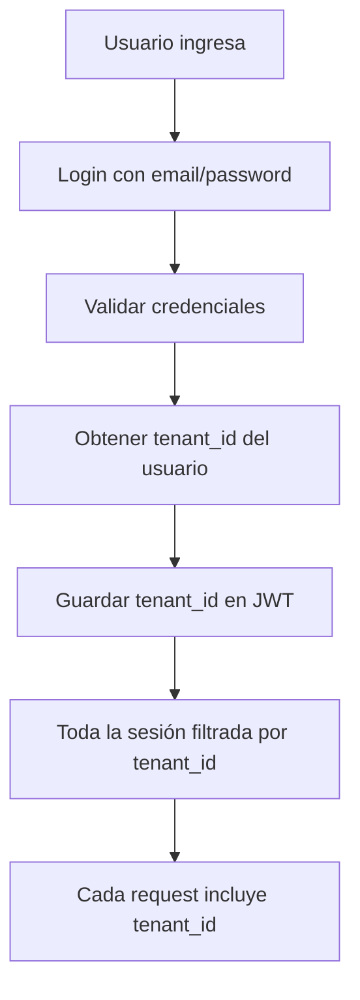

# Implementación Multitenant: Relación Usuario-Tenant

## Flujo Completo



## 1. Estructura de Base de Datos

### Modelo Prisma Actualizado

```prisma
// schema.prisma

model Tenant {
  id            String   @id @default(uuid())
  slug          String   @unique // empresa-abc
  nombre        String
  cuit          String   @unique
  razonSocial   String?
  direccion     String?
  telefono      String?
  email         String?
  plan          String   @default("basic") // basic, premium, enterprise
  activo        Boolean  @default(true)
  fechaCreacion DateTime @default(now())
  fechaVencimiento DateTime? // Para trials o planes pagos

  // Configuración específica del tenant
  configuracion Json     @default("{}")
  // Ejemplo: {
  //   "logo": "url-del-logo",
  //   "colores": { "primary": "#007bff" },
  //   "moneda": "ARS",
  //   "formatoFecha": "DD/MM/YYYY",
  //   "requiereAprobacion": true
  // }

  // Límites del plan
  limites       Json     @default("{}")
  // Ejemplo: {
  //   "usuarios": 10,
  //   "documentosMes": 1000,
  //   "storageMb": 5000
  // }

  // Relaciones
  usuarios      Usuario[]
  rendicionItems RendicionItem[]
  documentos    DocumentoProcesado[]
  resumenTarjetas ResumenTarjeta[]

  @@map("tenants")
}

model Usuario {
  id            Int      @id @default(autoincrement())
  email         String   @unique
  password      String
  nombre        String
  apellido      String

  // RELACIÓN CON TENANT
  tenantId      String
  tenant        Tenant   @relation(fields: [tenantId], references: [id])

  // Rol dentro del tenant
  rolTenant     String   @default("user") // user, admin, owner

  // El usuario puede acceder a múltiples tenants (futuro)
  // Para eso necesitaríamos una tabla intermedia UserTenant

  activo        Boolean  @default(true)
  fechaCreacion DateTime @default(now())

  // ... otras relaciones existentes
  @@index([tenantId])
  @@map("usuarios")
}

// Modelo opcional para usuarios con acceso a múltiples tenants
model UserTenant {
  id        String   @id @default(uuid())
  userId    Int
  tenantId  String
  rol       String   @default("user")
  activo    Boolean  @default(true)
  fechaInicio DateTime @default(now())
  fechaFin    DateTime?

  // Para casos especiales como consultores externos
  permisos  Json?    @default("[]")

  @@unique([userId, tenantId])
  @@map("user_tenants")
}
```

## 2. Backend: Sistema de Autenticación y Sesión

### Login con Tenant

```javascript
// backend/src/routes/auth.js

router.post('/login', async (req, res) => {
  try {
    const { email, password } = req.body;

    // 1. Buscar usuario con su tenant
    const usuario = await prisma.usuario.findUnique({
      where: { email },
      include: {
        tenant: true // Incluir datos del tenant
      }
    });

    if (!usuario || !bcrypt.compareSync(password, usuario.password)) {
      return res.status(401).json({ error: 'Credenciales inválidas' });
    }

    // 2. Verificar que el tenant esté activo
    if (!usuario.tenant.activo) {
      return res.status(403).json({
        error: 'La empresa está inactiva. Contacte al administrador.'
      });
    }

    // 3. Crear JWT con tenant_id incluido
    const token = jwt.sign(
      {
        userId: usuario.id,
        email: usuario.email,
        tenantId: usuario.tenantId, // <-- IMPORTANTE
        tenantSlug: usuario.tenant.slug,
        rolTenant: usuario.rolTenant
      },
      process.env.JWT_SECRET,
      { expiresIn: '7d' }
    );

    // 4. Retornar usuario con tenant info
    res.json({
      success: true,
      token,
      usuario: {
        id: usuario.id,
        nombre: usuario.nombre,
        apellido: usuario.apellido,
        email: usuario.email,
        rolTenant: usuario.rolTenant
      },
      tenant: {
        id: usuario.tenant.id,
        nombre: usuario.tenant.nombre,
        slug: usuario.tenant.slug,
        plan: usuario.tenant.plan,
        configuracion: usuario.tenant.configuracion
      }
    });

  } catch (error) {
    console.error('Login error:', error);
    res.status(500).json({ error: 'Error en login' });
  }
});
```

### Middleware de Autenticación con Tenant

```javascript
// backend/src/middleware/authWithTenant.js

const authWithTenant = async (req, res, next) => {
  try {
    // 1. Obtener token
    const token = req.headers.authorization?.replace('Bearer ', '');

    if (!token) {
      return res.status(401).json({ error: 'Token no proporcionado' });
    }

    // 2. Verificar token
    const decoded = jwt.verify(token, process.env.JWT_SECRET);

    // 3. Cargar usuario y tenant
    const usuario = await prisma.usuario.findUnique({
      where: { id: decoded.userId },
      include: {
        tenant: true
      }
    });

    if (!usuario || !usuario.activo) {
      return res.status(401).json({ error: 'Usuario no autorizado' });
    }

    if (!usuario.tenant.activo) {
      return res.status(403).json({ error: 'Tenant inactivo' });
    }

    // 4. Establecer en request para uso posterior
    req.userId = usuario.id;
    req.tenantId = usuario.tenantId;
    req.tenant = usuario.tenant;
    req.userRole = usuario.rolTenant;

    // 5. OPCIONAL: Configurar Prisma para Row Level Security
    // Esto hace que todas las queries automáticamente filtren por tenant
    req.prisma = new PrismaClient().$extends({
      query: {
        $allModels: {
          async $allOperations({ args, query }) {
            // Agregar tenantId a WHERE automáticamente
            if (args.where) {
              args.where.tenantId = req.tenantId;
            } else {
              args.where = { tenantId: req.tenantId };
            }
            return query(args);
          }
        }
      }
    });

    next();
  } catch (error) {
    console.error('Auth middleware error:', error);
    res.status(401).json({ error: 'Token inválido' });
  }
};

module.exports = authWithTenant;
```

### Aplicar Filtro por Tenant en Todas las Queries

```javascript
// backend/src/routes/rendiciones.js

const authWithTenant = require('../middleware/authWithTenant');

// Proteger todas las rutas
router.use(authWithTenant);

// Ahora todas las queries incluyen automáticamente el tenant
router.get('/', async (req, res) => {
  try {
    // Automáticamente filtrado por tenant
    const rendiciones = await prisma.rendicionItem.findMany({
      where: {
        tenantId: req.tenantId, // <-- Siempre filtrar por tenant
        activo: true
      },
      include: {
        usuario: true,
        resumenTarjeta: true
      }
    });

    res.json(rendiciones);
  } catch (error) {
    res.status(500).json({ error: 'Error obteniendo rendiciones' });
  }
});

// Crear nuevo item - automáticamente asignar tenant
router.post('/', async (req, res) => {
  try {
    const nuevoItem = await prisma.rendicionItem.create({
      data: {
        ...req.body,
        tenantId: req.tenantId, // <-- Asignar tenant automáticamente
        usuarioId: req.userId
      }
    });

    res.json(nuevoItem);
  } catch (error) {
    res.status(500).json({ error: 'Error creando rendición' });
  }
});
```

## 3. Frontend: Manejo de Tenant en la Sesión

### Context de Autenticación con Tenant

```javascript
// frontend/src/contexts/AuthContext.js

import { createContext, useContext, useState, useEffect } from 'react';
import { api } from '@/lib/api';

const AuthContext = createContext();

export const AuthProvider = ({ children }) => {
  const [user, setUser] = useState(null);
  const [tenant, setTenant] = useState(null);
  const [loading, setLoading] = useState(true);

  useEffect(() => {
    // Cargar usuario del localStorage si existe
    const token = localStorage.getItem('token');
    if (token) {
      loadUserData();
    } else {
      setLoading(false);
    }
  }, []);

  const loadUserData = async () => {
    try {
      const response = await api.get('/auth/me');
      setUser(response.data.usuario);
      setTenant(response.data.tenant);
    } catch (error) {
      console.error('Error loading user:', error);
      logout();
    } finally {
      setLoading(false);
    }
  };

  const login = async (email, password) => {
    try {
      const response = await api.post('/auth/login', { email, password });

      // Guardar token
      localStorage.setItem('token', response.data.token);

      // Configurar header por defecto para axios
      api.defaults.headers.common['Authorization'] = `Bearer ${response.data.token}`;

      // Guardar usuario y tenant
      setUser(response.data.usuario);
      setTenant(response.data.tenant);

      return { success: true };
    } catch (error) {
      return {
        success: false,
        error: error.response?.data?.error || 'Error en login'
      };
    }
  };

  const logout = () => {
    localStorage.removeItem('token');
    delete api.defaults.headers.common['Authorization'];
    setUser(null);
    setTenant(null);
  };

  return (
    <AuthContext.Provider value={{
      user,
      tenant,
      loading,
      login,
      logout,
      isAuthenticated: !!user,
      // Helpers útiles
      isAdmin: user?.rolTenant === 'admin' || user?.rolTenant === 'owner',
      isOwner: user?.rolTenant === 'owner',
      tenantName: tenant?.nombre,
      tenantSlug: tenant?.slug,
      tenantPlan: tenant?.plan,
      tenantConfig: tenant?.configuracion
    }}>
      {children}
    </AuthContext.Provider>
  );
};

export const useAuth = () => {
  const context = useContext(AuthContext);
  if (!context) {
    throw new Error('useAuth debe usarse dentro de AuthProvider');
  }
  return context;
};
```

### Mostrar Info del Tenant en UI

```javascript
// frontend/src/components/Header.js

import { useAuth } from '@/contexts/AuthContext';

export const Header = () => {
  const { user, tenant, logout } = useAuth();

  return (
    <header className="bg-white shadow">
      <div className="flex justify-between items-center px-6 py-4">
        <div className="flex items-center space-x-4">
          {/* Logo del tenant si existe */}
          {tenant?.configuracion?.logo ? (
            
          ) : (
            <h1 className="text-xl font-bold">{tenant?.nombre}</h1>
          )}

          {/* Badge del plan */}
          <span className={`px-2 py-1 text-xs rounded-full ${
            tenant?.plan === 'enterprise' ? 'bg-purple-100 text-purple-800' :
            tenant?.plan === 'premium' ? 'bg-blue-100 text-blue-800' :
            'bg-gray-100 text-gray-800'
          }`}>
            {tenant?.plan}
          </span>
        </div>

        <div className="flex items-center space-x-4">
          <span className="text-sm text-gray-600">
            {user?.nombre} {user?.apellido}
          </span>
          <button
            onClick={logout}
            className="text-sm text-red-600 hover:text-red-800"
          >
            Salir
          </button>
        </div>
      </div>
    </header>
  );
};
```

## 4. Casos de Uso Especiales

### Usuario con Acceso a Múltiples Tenants

```javascript
// backend/src/routes/auth.js

router.post('/switch-tenant', authMiddleware, async (req, res) => {
  const { tenantId } = req.body;

  // Verificar que el usuario tenga acceso a ese tenant
  const access = await prisma.userTenant.findUnique({
    where: {
      userId_tenantId: {
        userId: req.userId,
        tenantId: tenantId
      }
    },
    include: {
      tenant: true
    }
  });

  if (!access || !access.activo) {
    return res.status(403).json({ error: 'No tienes acceso a esta empresa' });
  }

  // Generar nuevo token con el nuevo tenant
  const newToken = jwt.sign(
    {
      userId: req.userId,
      tenantId: tenantId,
      tenantSlug: access.tenant.slug,
      rolTenant: access.rol
    },
    process.env.JWT_SECRET,
    { expiresIn: '7d' }
  );

  res.json({
    success: true,
    token: newToken,
    tenant: access.tenant
  });
});

// Listar tenants disponibles para el usuario
router.get('/my-tenants', authMiddleware, async (req, res) => {
  const tenants = await prisma.userTenant.findMany({
    where: {
      userId: req.userId,
      activo: true
    },
    include: {
      tenant: true
    }
  });

  res.json(tenants.map(ut => ({
    id: ut.tenant.id,
    nombre: ut.tenant.nombre,
    slug: ut.tenant.slug,
    rol: ut.rol
  })));
});
```

## 5. Seguridad y Mejores Prácticas

### Validación en Backend

```javascript
// Siempre validar que el recurso pertenece al tenant
router.get('/documento/:id', authWithTenant, async (req, res) => {
  const documento = await prisma.documentoProcesado.findFirst({
    where: {
      id: req.params.id,
      tenantId: req.tenantId // <-- CRÍTICO: Siempre validar tenant
    }
  });

  if (!documento) {
    return res.status(404).json({ error: 'Documento no encontrado' });
  }

  res.json(documento);
});
```

### Logs de Auditoría

```javascript
// Trackear accesos cross-tenant (para detectar intentos de acceso no autorizado)
const logTenantAccess = async (userId, tenantId, action, success) => {
  await prisma.auditLog.create({
    data: {
      userId,
      tenantId,
      action,
      success,
      timestamp: new Date(),
      ip: req.ip,
      userAgent: req.headers['user-agent']
    }
  });
};
```

## 6. Testing

```javascript
// tests/multitenant.test.js

describe('Multitenant System', () => {
  it('should isolate data between tenants', async () => {
    // Crear 2 tenants
    const tenant1 = await createTenant('empresa-a');
    const tenant2 = await createTenant('empresa-b');

    // Crear usuarios en cada tenant
    const user1 = await createUser('user1@empresa-a.com', tenant1.id);
    const user2 = await createUser('user2@empresa-b.com', tenant2.id);

    // Login como user1
    const token1 = await login('user1@empresa-a.com', 'password');

    // Crear rendición como user1
    const rend1 = await createRendicion(token1, { monto: 1000 });

    // Login como user2
    const token2 = await login('user2@empresa-b.com', 'password');

    // User2 NO debe ver la rendición de user1
    const rendiciones = await getRendiciones(token2);
    expect(rendiciones).toHaveLength(0);

    // User1 debe ver su rendición
    const rendicionesUser1 = await getRendiciones(token1);
    expect(rendicionesUser1).toHaveLength(1);
    expect(rendicionesUser1[0].id).toBe(rend1.id);
  });
});
```

¿Te parece bien esta implementación? Es exactamente como lo describiste:
1. Usuario se loguea
2. Se obtiene su tenant_id
3. Se guarda en el JWT/sesión
4. Todas las operaciones se filtran por ese tenant_id

¿Quieres que empecemos con la implementación real?