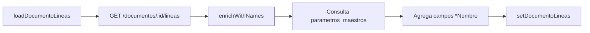
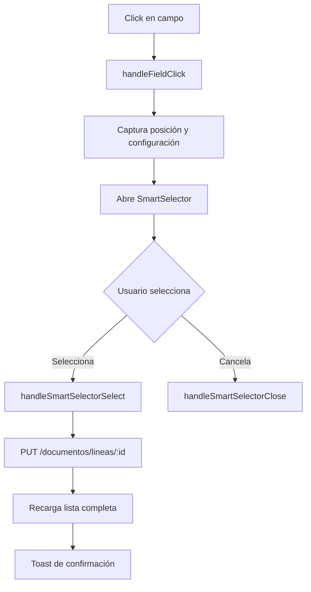
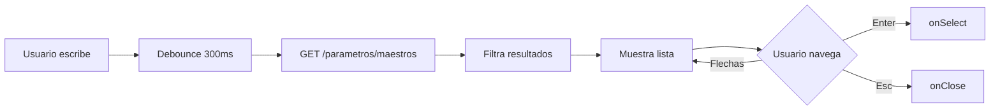

# Implementación de SmartSelector para Edición Inline de Campos

**Fecha**: 13 de Noviembre de 2025
**Sesión**: Implementación de edición inline profesional con SmartSelector

---

## 📋 Resumen Ejecutivo

Se implementó un sistema completo de edición inline para campos de líneas de items e impuestos en el modal de edición de documentos. Ahora los usuarios pueden hacer click en campos específicos para editarlos de manera profesional usando el componente `SmartSelector`, que busca valores en `parametros_maestros` con autocompletado y navegación por teclado.

---

## 🎯 Objetivos Cumplidos

### 1. Edición Inline con SmartSelector
- ✅ Click-to-edit en campos específicos de items e impuestos
- ✅ Búsqueda en tiempo real en parametros_maestros
- ✅ Autocompletado con debounce (300ms)
- ✅ Navegación por teclado (↑↓, Enter, Esc, Tab)
- ✅ Soporte para filtros en cascada (parent-child relationships)
- ✅ Pre-selección de valores existentes
- ✅ Guardado automático mediante API

### 2. Visualización Mejorada
- ✅ Mostrar "CÓDIGO - NOMBRE" en lugar de solo código
- ✅ Truncamiento de descripciones largas con ellipsis
- ✅ Tooltips completos al hacer hover
- ✅ Indicadores visuales de campos editables (hover effects)

### 3. Optimización de Performance
- ✅ Cache de búsquedas de parametros_maestros
- ✅ Una sola llamada a API por tipo de campo
- ✅ Enriquecimiento automático de datos al cargar

---

## 📁 Archivos Modificados

### `frontend/src/app/(protected)/parse/page.tsx`

#### **Imports Actualizados**
```typescript
import { SmartSelector } from '@/components/rendiciones/SmartSelector';
```
- Eliminados imports innecesarios de `Button` y `Card` que causaban errores

#### **Nuevos Estados (líneas 128-138)**
```typescript
// Estados para SmartSelector
const [showSmartSelector, setShowSmartSelector] = useState(false);
const [smartSelectorConfig, setSmartSelectorConfig] = useState<{
  fieldType: string;
  currentValue: string;
  parentValue?: string;
  entityType: 'item' | 'impuesto';
  entityId: string;
  fieldName: string;
  position: { x: number; y: number };
} | null>(null);
```

#### **Nueva Función: enrichWithNames() (líneas 318-363)**
Enriquece códigos con nombres de parametros_maestros de manera optimizada.

**Características:**
- Cache para evitar llamadas repetidas
- Una sola llamada a API por `tipo_campo`
- Mapeo automático de códigos a nombres

**Ejemplo de uso:**
```typescript
const lineasEnriquecidas = await enrichWithNames(lineas, [
  { field: 'tipoProducto', tipoCampo: 'tipo_producto', nameField: 'tipoProductoNombre' },
  { field: 'codigoProducto', tipoCampo: 'codigo_producto', nameField: 'codigoProductoNombre' }
]);
```

#### **Función Modificada: loadDocumentoLineas() (líneas 365-390)**
Ahora enriquece automáticamente 6 campos:
1. `tipoProducto` → `tipoProductoNombre`
2. `codigoProducto` → `codigoProductoNombre`
3. `codigoDimension` → `codigoDimensionNombre`
4. `subcuenta` → `subcuentaNombre`
5. `cuentaContable` → `cuentaContableNombre`
6. `tipoOrdenCompra` → `tipoOrdenCompraNombre`

#### **Función Modificada: loadDocumentoImpuestos() (líneas 605-626)**
Enriquece 3 campos de impuestos:
1. `codigoDimension` → `codigoDimensionNombre`
2. `subcuenta` → `subcuentaNombre`
3. `cuentaContable` → `cuentaContableNombre`

#### **Nuevas Funciones de Control (líneas 722-778)**

**1. handleFieldClick()**
Abre el SmartSelector al hacer click en un campo editable.
```typescript
const handleFieldClick = (
  e: React.MouseEvent,
  fieldType: string,
  currentValue: string,
  entityType: 'item' | 'impuesto',
  entityId: string,
  fieldName: string,
  parentValue?: string
)
```

**2. handleSmartSelectorSelect()**
Guarda el valor seleccionado mediante API y recarga la lista.
```typescript
const handleSmartSelectorSelect = async (codigo: string, nombre: string)
```
- Endpoint para items: `PUT /documentos/lineas/:id`
- Endpoint para impuestos: `PUT /documentos/impuestos/:id`

**3. handleSmartSelectorClose()**
Cierra el SmartSelector sin guardar cambios.

#### **Campos Editables en Items (líneas 2103-2169)**

Todos con clase `bg-blue-50` y hover `bg-blue-100`:

| Campo | Tipo Campo | Parent Value | Descripción |
|-------|------------|--------------|-------------|
| Tipo Producto | `tipo_producto` | - | Tipo de producto |
| Cód. Producto | `codigo_producto` | `tipoProducto` | Código filtrado por tipo |
| Dimensión | `codigo_dimension` | - | Código de dimensión |
| Subcuenta | `subcuenta` | `codigoDimension` | Subcuenta filtrada por dimensión |
| Cuenta Contable | `cuenta_contable` | `subcuenta` | Cuenta contable filtrada |
| Tipo OC | `tipo_orden_compra` | - | Tipo de orden de compra |

**Visualización:**
```typescript
<span className="text-gray-800 truncate block"
      title={linea.tipoProducto && linea.tipoProductoNombre
        ? `${linea.tipoProducto} - ${linea.tipoProductoNombre}`
        : linea.tipoProducto || '-'}>
  {linea.tipoProducto
    ? `${linea.tipoProducto}${linea.tipoProductoNombre ? ` - ${linea.tipoProductoNombre}` : ''}`
    : '-'}
</span>
```

#### **Campos Editables en Impuestos (líneas 2262-2294)**

Todos con clase `bg-green-50` y hover `bg-green-100`:

| Campo | Tipo Campo | Parent Value | Descripción |
|-------|------------|--------------|-------------|
| Dimensión | `codigo_dimension` | - | Código de dimensión |
| Subcuenta | `subcuenta` | `codigoDimension` | Subcuenta filtrada |
| Cuenta Contable | `cuenta_contable` | `subcuenta` | Cuenta contable filtrada |

#### **Descripciones Truncadas**

**Items (línea 2039-2041):**
```typescript
<h4 className="font-semibold text-gray-900 text-sm truncate"
    title={linea.descripcion}>
  {linea.descripcion}
</h4>
```

**Impuestos (línea 2218-2220):**
```typescript
<h4 className="font-semibold text-gray-900 text-sm truncate"
    title={impuesto.descripcion}>
  {impuesto.descripcion}
</h4>
```

#### **Renderizado del SmartSelector (líneas 2985-2995)**
```typescript
{showSmartSelector && smartSelectorConfig && (
  <SmartSelector
    value={smartSelectorConfig.currentValue}
    fieldType={smartSelectorConfig.fieldType}
    parentValue={smartSelectorConfig.parentValue}
    onSelect={handleSmartSelectorSelect}
    onClose={handleSmartSelectorClose}
    position={smartSelectorConfig.position}
  />
)}
```

---

## 🔄 Flujo de Trabajo del Sistema

### 1. Carga Inicial de Documento


### 2. Edición de Campo


### 3. SmartSelector Interno


---

## 📊 Campos Enriquecidos - Mapeo Completo

### Items (documento_lineas)

| Campo DB | Campo Nombre | Tipo Campo | Editable | Parent |
|----------|--------------|------------|----------|--------|
| tipoProducto | tipoProductoNombre | tipo_producto | ✅ | - |
| codigoProducto | codigoProductoNombre | codigo_producto | ✅ | tipoProducto |
| codigoDimension | codigoDimensionNombre | codigo_dimension | ✅ | - |
| subcuenta | subcuentaNombre | subcuenta | ✅ | codigoDimension |
| cuentaContable | cuentaContableNombre | cuenta_contable | ✅ | subcuenta |
| tipoOrdenCompra | tipoOrdenCompraNombre | tipo_orden_compra | ✅ | - |
| ordenCompra | - | - | ❌ | - |

### Impuestos (documento_impuestos)

| Campo DB | Campo Nombre | Tipo Campo | Editable | Parent |
|----------|--------------|------------|----------|--------|
| codigoDimension | codigoDimensionNombre | codigo_dimension | ✅ | - |
| subcuenta | subcuentaNombre | subcuenta | ✅ | codigoDimension |
| cuentaContable | cuentaContableNombre | cuenta_contable | ✅ | subcuenta |

---

## 🎨 Clases CSS Utilizadas

### Campos Editables

**Items (azul):**
```css
bg-blue-50          /* Fondo normal */
hover:bg-blue-100   /* Fondo al hover */
cursor-pointer      /* Cursor de puntero */
transition-colors   /* Transición suave */
```

**Impuestos (verde):**
```css
bg-green-50         /* Fondo normal */
hover:bg-green-100  /* Fondo al hover */
cursor-pointer      /* Cursor de puntero */
transition-colors   /* Transición suave */
```

### Textos
```css
truncate            /* Truncar con ellipsis */
block               /* Display block necesario para truncate */
text-gray-800       /* Color del texto */
font-medium         /* Peso de la fuente */
```

---

## 🔌 APIs Utilizadas

### Lectura de Datos

**GET /api/documentos/:id/lineas**
- Devuelve: `{ success: true, lineas: [], totales: {} }`
- Usado por: `loadDocumentoLineas()`

**GET /api/documentos/:id/impuestos**
- Devuelve: `{ success: true, impuestos: [], totales: {} }`
- Usado por: `loadDocumentoImpuestos()`

**GET /api/parametros/maestros?tipo_campo=:tipo**
- Devuelve: `{ success: true, parametros: [] }`
- Usado por: `enrichWithNames()`, `SmartSelector`

### Escritura de Datos

**PUT /api/documentos/lineas/:id**
- Body: `{ [fieldName]: codigo }`
- Ejemplo: `{ tipoProducto: "GS" }`
- Usado por: `handleSmartSelectorSelect()`

**PUT /api/documentos/impuestos/:id**
- Body: `{ [fieldName]: codigo }`
- Ejemplo: `{ cuentaContable: "5.1.01" }`
- Usado por: `handleSmartSelectorSelect()`

---

## 🐛 Problemas Resueltos

### 1. Error de Compilación TypeScript
**Problema:** `Type 'Set<any>' can only be iterated through when using --downlevelIteration flag`

**Solución:**
```typescript
// ❌ Antes
const uniqueCodes = [...new Set(array)];

// ✅ Después
const uniqueCodes = Array.from(new Set(array));
```

### 2. Imports Innecesarios
**Problema:** `Cannot find module '@/components/ui/Button'`

**Solución:** Eliminados imports de `Button` y `Card` que no se usaban.

```typescript
// ❌ Antes
import { Button } from '@/components/ui/Button';
import { Card, CardContent } from '@/components/ui/Card';

// ✅ Después - Eliminados
```

### 3. Múltiples Llamadas a API
**Problema:** La función `enrichWithNames()` original hacía una llamada por cada código único.

**Solución:** Cache por `tipo_campo` con una sola llamada a API.

```typescript
// Cache para evitar llamadas repetidas
const cache: Record<string, Record<string, string>> = {};

// Una sola llamada por tipo de campo
if (!cache[tipoCampo]) {
  const response = await parametrosApi.getPorCampo(tipoCampo);
  response.parametros.forEach((p: ParametroMaestro) => {
    cache[tipoCampo][p.codigo] = p.nombre;
  });
}
```

---

## 💡 Características Destacadas

### 1. Pre-selección Inteligente
Cuando abres un campo con datos existentes, el SmartSelector:
- Muestra el valor actual en el input de búsqueda
- Resalta el item correspondiente en la lista
- Hace scroll para que esté visible
- Permite cambiar o mantener el valor con Enter

### 2. Filtros en Cascada
Los campos con dependencias se filtran automáticamente:
- **Código Producto** solo muestra productos del **Tipo** seleccionado
- **Subcuenta** solo muestra opciones de la **Dimensión** seleccionada
- **Cuenta Contable** se filtra por **Subcuenta**

### 3. Tooltips Informativos
- **Campos con código+nombre:** Tooltip muestra el valor completo
- **Descripciones:** Tooltip muestra la descripción completa sin truncar
- Mejora la UX sin ocupar espacio visual

### 4. Indicadores Visuales
- **Azul:** Campos de items editables
- **Verde:** Campos de impuestos editables
- **Gris:** Campos no editables (solo lectura)
- **Hover:** Cambio de tono para indicar interactividad

---

## 🚀 Mejoras Futuras Sugeridas

### 1. Backend: Enriquecimiento en el Servidor
Actualmente el frontend hace múltiples llamadas a `parametros_maestros`. Mejor:

```javascript
// backend/src/routes/documentos.js
router.get('/:id/lineas', authWithTenant, async (req, res) => {
  const lineas = await prisma.documento_lineas.findMany({...});

  // Enriquecer con nombres en el backend
  const lineasEnriquecidas = await enrichLineasWithNames(lineas, tenantId);

  res.json({ success: true, lineas: lineasEnriquecidas });
});
```

**Beneficios:**
- Menos llamadas desde el frontend
- Carga inicial más rápida
- Código más limpio en el cliente

### 2. Cache en el Frontend
Implementar cache global de parametros_maestros:

```typescript
// frontend/src/lib/parametrosCache.ts
class ParametrosCache {
  private cache = new Map<string, ParametroMaestro[]>();
  private expiryTime = 5 * 60 * 1000; // 5 minutos

  async get(tipoCampo: string): Promise<ParametroMaestro[]> {
    if (this.cache.has(tipoCampo)) {
      return this.cache.get(tipoCampo)!;
    }

    const response = await parametrosApi.getPorCampo(tipoCampo);
    this.cache.set(tipoCampo, response.parametros);

    setTimeout(() => this.cache.delete(tipoCampo), this.expiryTime);

    return response.parametros;
  }
}

export const parametrosCache = new ParametrosCache();
```

### 3. Edición Inline en la Tabla Principal
Extender SmartSelector a la tabla principal de documentos:
- Editar proveedor
- Editar tipo de comprobante
- Editar centro de costo

### 4. Validaciones Mejoradas
Agregar validaciones antes de guardar:
- Campos requeridos
- Relaciones válidas (producto debe pertenecer al tipo)
- Duplicados

### 5. Historial de Cambios
Registrar quién modificó qué y cuándo:

```sql
CREATE TABLE documento_lineas_audit (
  id UUID PRIMARY KEY,
  linea_id UUID,
  campo VARCHAR(50),
  valor_anterior VARCHAR(100),
  valor_nuevo VARCHAR(100),
  usuario_id UUID,
  fecha TIMESTAMP DEFAULT NOW()
);
```

---

## 📝 Notas Importantes para Próximas Sesiones

### Estado del Proyecto
- ✅ SmartSelector completamente funcional
- ✅ Enriquecimiento de datos implementado
- ✅ Visualización optimizada con truncamiento
- ⚠️ Requiere reinicio del servidor de desarrollo después de limpiar cache
- ⚠️ Error preexistente en `sugerencias-ia/page.tsx` (no relacionado con estos cambios)

### Comandos para Desarrollo
```bash
# Limpiar cache de Next.js
cd frontend && rm -rf .next

# Reiniciar servidor de desarrollo
cd frontend && npm run dev

# Verificar tipos (ignorar errores de otros archivos)
cd frontend && npx tsc --noEmit src/app/(protected)/parse/page.tsx
```

### Archivos Críticos
1. **`frontend/src/app/(protected)/parse/page.tsx`** - Lógica principal
2. **`frontend/src/components/rendiciones/SmartSelector.tsx`** - Componente reutilizable
3. **`backend/src/routes/documentos.js`** - Endpoints de API
4. **`backend/prisma/schema.prisma`** - Estructura de BD

### Testing Manual Recomendado
1. Abrir modal de edición de documento
2. Ir a tab "Items"
3. Click en cualquier campo azul (ej: Tipo Producto)
4. Verificar que SmartSelector abre con lista
5. Escribir para filtrar
6. Seleccionar un valor
7. Verificar que se guarda y muestra "CÓDIGO - NOMBRE"
8. Repetir con campos verdes en tab "Impuestos"

### Datos de Prueba
Los documentos del tenant **Timbo** (`4b458e4f-f35d-47c4-a9d5-0960c1858939`) tienen:
- ✅ Líneas de items con campos para editar
- ✅ Impuestos con campos contables
- ✅ Parametros maestros configurados

---

## 📚 Referencias

### Documentación Técnica
- [SmartSelector Component](frontend/src/components/rendiciones/SmartSelector.tsx)
- [Parametros Maestros API](backend/src/routes/parametros.js)
- [Schema Prisma](backend/prisma/schema.prisma)

### Componentes Relacionados
- `DocumentUploadModal` - Modal para subir documentos
- `DocumentViewerProvider` - Contexto para visualizar documentos
- `useDocumentViewer` - Hook personalizado
- `useConfirmDialog` - Dialogs de confirmación

### Convenciones de Código
- **Campos editables:** Siempre con `onClick` y classes hover
- **Parent-child:** Pasar `parentValue` cuando hay dependencia
- **Nomenclatura:** `campo` + `campoNombre` para campos enriquecidos
- **Tipo campo:** Usar snake_case para `tipo_campo` en API

---

## 🎯 Checklist de Implementación Completa

- [x] Agregar imports de SmartSelector
- [x] Definir estados para control del SmartSelector
- [x] Crear función `enrichWithNames()` optimizada
- [x] Modificar `loadDocumentoLineas()` para enriquecer
- [x] Modificar `loadDocumentoImpuestos()` para enriquecer
- [x] Implementar `handleFieldClick()`
- [x] Implementar `handleSmartSelectorSelect()`
- [x] Implementar `handleSmartSelectorClose()`
- [x] Hacer campos de items clickeables (6 campos)
- [x] Hacer campos de impuestos clickeables (3 campos)
- [x] Actualizar visualización para mostrar código + nombre
- [x] Agregar truncamiento a descripciones
- [x] Agregar tooltips informativos
- [x] Renderizar SmartSelector en el JSX
- [x] Eliminar imports innecesarios
- [x] Resolver errores de TypeScript
- [x] Documentar implementación completa

---

**Fin del Documento**
