# Parse API Pública - Ejemplos de Uso

Esta carpeta contiene ejemplos completos de cómo integrar con la API pública de Parse usando diferentes lenguajes de programación.

## 📋 Contenido

- **`javascript-example.js`** - Ejemplo completo con Node.js y Axios
- **`python-example.py`** - Ejemplo completo con Python y Requests
- **`curl-examples.sh`** - Ejemplos con cURL (Bash script)
- **`README.md`** - Este archivo

## 🚀 Quick Start

### 1. Obtener credenciales OAuth

Primero necesitas crear un cliente OAuth desde el panel de administración de Parse:

1. Accede a https://parsedemo.axiomacloud.com
2. Ve a **"API Clients"** en el menú
3. Crea un nuevo cliente OAuth
4. **Guarda el `client_id` y `client_secret`** (solo se muestra una vez)

### 2. JavaScript / Node.js

```bash
# Instalar dependencias
npm install axios

# Configurar credenciales
export CLIENT_ID=client_abc123xyz
export CLIENT_SECRET=secret_xyz789abc
export API_BASE_URL=https://api.parsedemo.axiomacloud.com

# Ejecutar ejemplo
node javascript-example.js
```

### 3. Python

```bash
# Instalar dependencias
pip install requests

# Configurar credenciales
export CLIENT_ID=client_abc123xyz
export CLIENT_SECRET=secret_xyz789abc
export API_BASE_URL=https://api.parsedemo.axiomacloud.com

# Ejecutar ejemplo
python python-example.py
```

### 4. cURL

```bash
# Configurar credenciales
export CLIENT_ID=client_abc123xyz
export CLIENT_SECRET=secret_xyz789abc
export API_BASE_URL=https://api.parsedemo.axiomacloud.com

# Ejecutar ejemplo
bash curl-examples.sh
```

**Tip:** Instala `jq` para mejor formateo del JSON:
```bash
# Ubuntu/Debian
sudo apt-get install jq

# MacOS
brew install jq
```

## 📚 Documentación Interactiva

La API incluye documentación interactiva con Swagger UI:

**URL:** https://api.parsedemo.axiomacloud.com/api/v1/docs

Desde ahí puedes:
- ✅ Ver todos los endpoints disponibles
- ✅ Probar los endpoints directamente desde el navegador
- ✅ Ver modelos de datos (schemas)
- ✅ Copiar ejemplos de requests/responses

## 🔐 Autenticación OAuth 2.0

La API usa **OAuth 2.0 Client Credentials** flow:

### Flujo de autenticación

```mermaid
sequenceDiagram
    participant App as Tu Aplicación
    participant API as Parse API

    App->>API: POST /api/v1/auth/token (client_id, client_secret)
    API->>App: access_token + refresh_token

    App->>API: GET /api/v1/documents (Bearer token)
    API->>App: Lista de documentos

    Note over App,API: Cuando el token expira (1 hora)

    App->>API: POST /api/v1/auth/refresh (refresh_token)
    API->>App: Nuevo access_token
```



### Scopes disponibles

- `read:documents` - Leer documentos procesados
- `write:documents` - Marcar documentos como exportados
- `read:files` - Descargar archivos originales

## 🎯 Ejemplos de uso por caso

### Caso 1: Obtener facturas del último mes

**JavaScript:**
```javascript
const resultado = await client.listarDocumentos({
  tipoComprobante: 'FACTURA_A',
  fechaDesde: '2025-01-01',
  fechaHasta: '2025-01-31',
  exportado: false,
  limit: 100
});
```

**Python:**
```python
resultado = client.listar_documentos(
    tipo_comprobante='FACTURA_A',
    fecha_desde='2025-01-01',
    fecha_hasta='2025-01-31',
    exportado=False,
    limit=100
)
```

**cURL:**
```bash
curl -X GET "${API_BASE_URL}/api/v1/documents?tipoComprobante=FACTURA_A&fechaDesde=2025-01-01&fechaHasta=2025-01-31&exportado=false&limit=100" \
  -H "Authorization: Bearer ${ACCESS_TOKEN}"
```

### Caso 2: Exportar documentos a ERP

```javascript
// 1. Obtener documentos no exportados
const { documents } = await client.listarDocumentos({
  exportado: false,
  status: 'completado',
  limit: 50
});

// 2. Procesar cada documento
for (const doc of documents) {
  // Obtener detalle completo
  const detalle = await client.obtenerDocumento(doc.id);
  const lineas = await client.obtenerLineasDocumento(doc.id);
  const impuestos = await client.obtenerImpuestosDocumento(doc.id);

  // Enviar a tu ERP
  const erpId = await tuERP.crearFactura({
    documento: detalle,
    lineas: lineas,
    impuestos: impuestos
  });

  // Marcar como exportado en Parse
  await client.marcarComoExportado(doc.id, erpId);
}
```

### Caso 3: Sincronización periódica

```javascript
// Ejecutar cada hora con cron
async function sincronizarDocumentos() {
  const client = new ParseAPIClient(...);
  await client.obtenerToken();

  // Obtener solo documentos nuevos desde última sincronización
  const ultimaSinc = await db.getUltimaSincronizacion();

  const { documents } = await client.listarDocumentos({
    fechaDesde: ultimaSinc,
    exportado: false,
    limit: 1000
  });

  for (const doc of documents) {
    await procesarDocumento(doc);
  }

  await db.actualizarUltimaSincronizacion(new Date());
}
```

## ⚡ Rate Limiting

Todos los clientes tienen límites de tasa:

**Límites por defecto:**
- 60 requests/minuto
- 1,000 requests/hora
- 10,000 requests/día

**Headers de respuesta:**
```
X-RateLimit-Limit: 60
X-RateLimit-Remaining: 45
X-RateLimit-Reset: 1642785600
```

Si excedes el límite, recibirás:
```json
{
  "success": false,
  "error": "rate_limit_exceeded",
  "message": "Too many requests. Retry after 60 seconds.",
  "retryAfter": 60
}
```

**Solución:** Implementa retry con exponential backoff:

```javascript
async function requestWithRetry(fn, maxRetries = 3) {
  for (let i = 0; i < maxRetries; i++) {
    try {
      return await fn();
    } catch (error) {
      if (error.response?.status === 429) {
        const retryAfter = parseInt(error.response.headers['retry-after']) || 60;
        console.log(`Rate limited. Retrying in ${retryAfter}s...`);
        await sleep(retryAfter * 1000);
        continue;
      }
      throw error;
    }
  }
}
```

## 🔒 Seguridad

### ✅ Buenas prácticas

- **NUNCA** pongas credenciales en el código
- Usa variables de entorno (`process.env`, `os.getenv()`)
- Almacena `client_secret` en un gestor de secretos (AWS Secrets Manager, Vault, etc.)
- Rota las credenciales periódicamente
- Usa HTTPS siempre (nunca HTTP)

### ❌ Malas prácticas

```javascript
// ❌ MAL: Credenciales hardcodeadas
const CLIENT_ID = 'client_abc123';
const CLIENT_SECRET = 'secret_xyz789';

// ✅ BIEN: Variables de entorno
const CLIENT_ID = process.env.CLIENT_ID;
const CLIENT_SECRET = process.env.CLIENT_SECRET;
```

## 🐛 Debugging

### Habilitar logs detallados

**JavaScript:**
```javascript
apiClient.interceptors.request.use(request => {
  console.log('Request:', request.method.toUpperCase(), request.url);
  return request;
});

apiClient.interceptors.response.use(response => {
  console.log('Response:', response.status, response.data);
  return response;
});
```

**Python:**
```python
import logging
logging.basicConfig(level=logging.DEBUG)
```

**cURL:**
```bash
# Ver headers de request/response
curl -v -X GET "${API_BASE_URL}/api/v1/documents" \
  -H "Authorization: Bearer ${ACCESS_TOKEN}"
```

## 📞 Soporte

- **Documentación:** https://api.parsedemo.axiomacloud.com/api/v1/docs
- **Email:** soporte@parsedemo.axiomacloud.com
- **GitHub Issues:** https://github.com/martin4yo/parse/issues

## 📄 Licencia

Privado - Solo para clientes de Parse
