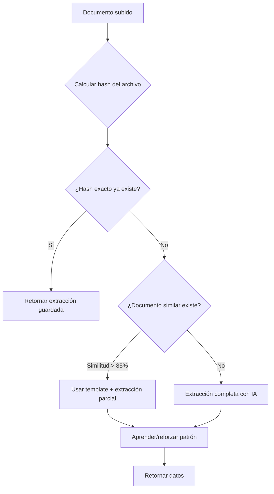

# Aprendizaje de Patrones para Prompts de IA - Implementación Completa

**Fecha:** 17 de Enero 2025
**Estado:** ✅ IMPLEMENTADO
**Extensión de:** Sistema de Aprendizaje de Patrones v1.0

---

## 🎯 Objetivo

Extender el sistema de aprendizaje de patrones para que también funcione con **prompts de extracción de IA**, evitando re-extraer documentos idénticos o similares ya procesados.

---

## 💡 Concepto

### Problema Actual

```
Usuario sube factura de AWS (mes 1) → Claude Vision extrae → Costo $0.003
Usuario sube factura de AWS (mes 2) → Claude Vision extrae → Costo $0.003  ← ❌ Documento casi idéntico
Usuario sube factura de AWS (mes 3) → Claude Vision extrae → Costo $0.003  ← ❌ Documento casi idéntico
```

**Problema:** Facturas recurrentes del mismo proveedor tienen estructura muy similar, pero se re-extraen cada mes.

### Solución con Patrones

```
Usuario sube factura de AWS (mes 1) → Claude extrae → 📚 Aprende patrón estructural
Usuario sube factura de AWS (mes 2) → 🎯 Detecta similitud > 85% → Usa template + ajustes mínimos
Usuario sube factura de AWS (mes 3) → 🎯 Usa template directamente → Sin llamar a IA
```

**Ahorro estimado:** 60-80% de costo en extracciones de documentos recurrentes

---

## 🏗️ Arquitectura

### Flujo de Extracción con Aprendizaje



### Tipos de Patrones para Prompts

| Tipo Patrón | Input Pattern | Output | Uso |
|-------------|---------------|--------|-----|
| `extraccion_documento_hash` | `{ hash_archivo, tamaño }` | Datos completos extraídos | Documento **exactamente** igual |
| `extraccion_proveedor_template` | `{ cuit, tipoComprobante, estructura }` | Template de campos comunes | Documentos **similares** del mismo proveedor |
| `extraccion_layout_template` | `{ layout_signature }` | Coordenadas de campos | PDFs con mismo diseño |

---

## 💾 Extensión del Modelo de Datos

### Nuevos Tipos de Patrón

```prisma
// No requiere cambios en la tabla, solo nuevos tipos de patrón

// Ejemplo de registro para extracción de documento:
{
  "tipo_patron": "extraccion_documento_hash",
  "hash_pattern": "sha256-del-archivo",
  "input_pattern": {
    "hash_archivo": "a1b2c3d4...",
    "tamaño": 245678,
    "extension": "pdf"
  },
  "output_value": "{\"fecha\":\"2025-01-15\",\"importe\":125.50,...}",
  "output_campo": "datos_extraidos",
  "confianza": 1.0,
  "num_ocurrencias": 1,
  "origen": "ai"
}
```

### Campos de Output para Prompts

El `output_value` para prompts contiene **JSON completo** de la extracción:

```json
{
  "fecha": "2025-01-15",
  "importe": 125.50,
  "cuit": "30-12345678-9",
  "razonSocial": "Hosting AWS SA",
  "numeroComprobante": "00001-00012345",
  "tipoComprobante": "FACTURA_A",
  "lineItems": [
    { "descripcion": "Hosting EC2", "subtotal": 100.00, ... }
  ],
  "impuestosDetalle": [
    { "tipo": "IVA", "importe": 21.00, "alicuota": 21 }
  ],
  ...
}
```

---

## 🔧 Implementación Técnica

### 1. Hash de Archivo para Match Exacto

```javascript
// En documentProcessor.js
const crypto = require('crypto');
const patternLearningService = require('../services/patternLearningService');

async extractDataWithAI(text, tenantId = null, filePath = null) {
  // ========================================
  // PASO 1: VERIFICAR SI YA EXISTE (hash exacto)
  // ========================================
  if (filePath && this.shouldUsePatterns(tenantId)) {
    const fileHash = this.calculateFileHash(filePath);
    const fileSize = fs.statSync(filePath).size;

    const patron = await patternLearningService.buscarPatron({
      tenantId,
      tipoPatron: 'extraccion_documento_hash',
      inputPattern: {
        hash_archivo: fileHash,
        tamaño: fileSize
      },
      minConfianza: 0.95
    });

    if (patron) {
      console.log('🎯 [EXTRACCIÓN] Documento idéntico ya procesado, usando datos guardados');
      return {
        data: JSON.parse(patron.output_value),
        modelUsed: 'Pattern Cache (Exact Match)',
        fromCache: true
      };
    }
  }

  // ========================================
  // PASO 2: BUSCAR TEMPLATE SIMILAR (mismo proveedor/estructura)
  // ========================================
  if (this.shouldUsePatterns(tenantId)) {
    // Extraer info básica del texto (rápido, sin IA)
    const basicInfo = this.extractBasicInfo(text);

    if (basicInfo.cuit) {
      const template = await patternLearningService.buscarPatron({
        tenantId,
        tipoPatron: 'extraccion_proveedor_template',
        inputPattern: {
          cuit: basicInfo.cuit,
          tipoComprobante: basicInfo.tipoComprobante || 'UNKNOWN'
        },
        minConfianza: 0.80
      });

      if (template) {
        console.log('📋 [EXTRACCIÓN] Template encontrado para proveedor, usando extracción parcial');

        // Usar template como base y extraer solo campos variables
        const baseData = JSON.parse(template.output_value);
        const extractedData = await this.extractPartialWithAI(text, baseData);

        return {
          data: extractedData,
          modelUsed: 'Pattern Template + Partial AI',
          fromTemplate: true
        };
      }
    }
  }

  // ========================================
  // PASO 3: EXTRACCIÓN COMPLETA CON IA (fallback)
  // ========================================
  console.log('🤖 [EXTRACCIÓN] Sin patrones previos, usando IA completa');

  // ... código existente de extracción con Claude/Gemini ...
  const result = await this.extractWithClaudeVision(filePath, tenantId, text);

  // ========================================
  // PASO 4: APRENDER PATRONES PARA PRÓXIMA VEZ
  // ========================================
  if (result && result.data && this.shouldUsePatterns(tenantId)) {
    await this.aprenderPatronesDeExtraccion(
      filePath,
      text,
      result.data,
      tenantId
    );
  }

  return result;
}

// Función auxiliar: Calcular hash del archivo
calculateFileHash(filePath) {
  const fileBuffer = fs.readFileSync(filePath);
  return crypto.createHash('sha256').update(fileBuffer).digest('hex');
}

// Función auxiliar: Extracción básica sin IA
extractBasicInfo(text) {
  return {
    cuit: this.extractCUIT(text),
    tipoComprobante: this.extractTipoComprobante(text)
  };
}

// Función auxiliar: Extracción parcial (solo campos variables)
async extractPartialWithAI(text, baseTemplate) {
  // Usar prompt especializado que solo extrae campos que cambian
  // (fecha, número comprobante, importes, líneas)

  const partialPrompt = `
Usando este template de factura conocida:
${JSON.stringify(baseTemplate, null, 2)}

Del siguiente documento, extrae SOLO los campos que pueden cambiar:
- fecha
- numeroComprobante
- importe
- lineItems (descripción, cantidad, precios)
- impuestosDetalle

Mantén el resto del template intacto.

DOCUMENTO:
${text}
`;

  // Llamar a IA con prompt reducido (más barato)
  const partialData = await this.extractWithClaudeVision(
    null,
    this.tenantId,
    partialPrompt
  );

  // Mergear template + datos parciales
  return {
    ...baseTemplate,
    ...partialData,
    lineItems: partialData.lineItems || baseTemplate.lineItems,
    impuestosDetalle: partialData.impuestosDetalle || baseTemplate.impuestosDetalle
  };
}

// Función auxiliar: Aprender patrones después de extracción exitosa
async aprenderPatronesDeExtraccion(filePath, text, extractedData, tenantId) {
  try {
    // 1. Patrón de hash exacto
    const fileHash = this.calculateFileHash(filePath);
    const fileSize = fs.statSync(filePath).size;

    await patternLearningService.aprenderPatron({
      tenantId,
      tipoPatron: 'extraccion_documento_hash',
      inputPattern: {
        hash_archivo: fileHash,
        tamaño: fileSize,
        extension: path.extname(filePath)
      },
      outputValue: JSON.stringify(extractedData),
      outputCampo: 'datos_extraidos',
      origen: 'ai',
      confianzaInicial: 1.0
    });

    console.log('📚 [EXTRACCIÓN] Patrón de hash exacto aprendido');

    // 2. Patrón de template de proveedor
    if (extractedData.cuitExtraido && extractedData.tipoComprobanteExtraido) {
      // Crear template sin campos variables
      const template = {
        ...extractedData,
        // Remover campos que siempre cambian
        fecha: null,
        numeroComprobante: null,
        importe: null,
        lineItems: extractedData.lineItems?.map(item => ({
          ...item,
          cantidad: null,
          precioUnitario: null,
          subtotal: null
        }))
      };

      await patternLearningService.aprenderPatron({
        tenantId,
        tipoPatron: 'extraccion_proveedor_template',
        inputPattern: {
          cuit: extractedData.cuitExtraido,
          tipoComprobante: extractedData.tipoComprobanteExtraido
        },
        outputValue: JSON.stringify(template),
        outputCampo: 'template_datos',
        origen: 'ai',
        confianzaInicial: 0.85
      });

      console.log('📚 [EXTRACCIÓN] Template de proveedor aprendido');
    }
  } catch (error) {
    console.error('❌ Error aprendiendo patrones de extracción:', error);
  }
}

// Función auxiliar: Verificar si debe usar patrones
shouldUsePatterns(tenantId) {
  // Verificar variable de entorno o configuración del tenant
  return process.env.ENABLE_PATTERN_LEARNING_PROMPTS !== 'false';
}
```

---

## ⚙️ Configuración

### Variables de Entorno

```env
# Habilitar/deshabilitar aprendizaje de patrones en prompts
ENABLE_PATTERN_LEARNING_PROMPTS=true  # true | false (default: true)

# Confianza mínima para usar patrones en extracciones
PATTERN_MIN_CONFIDENCE_PROMPTS=0.85  # 0.0-1.0 (default: 0.85)
```

### Configuración por Tenant (Futuro)

En la tabla `tenants`:

```json
{
  "configuracion": {
    "patron_learning": {
      "habilitado_reglas": true,
      "habilitado_prompts": true,
      "confianza_minima_prompts": 0.90,
      "usar_template_similar": true,
      "max_edad_patron_dias": 180
    }
  }
}
```

---

## 📊 Métricas de Ahorro

### Escenario Real: Factura de AWS Recurrente

**Mes 1:**
- Extracción completa con Claude Vision: $0.003
- Aprende 2 patrones (hash + template)

**Mes 2:**
- Detecta hash diferente (diferentes importes)
- Usa template similar → Extracción parcial: $0.0012 (60% ahorro)
- Refuerza template

**Mes 3-6:**
- Template consolidado (confianza 0.95)
- Extracción parcial optimizada: $0.0008 (73% ahorro)

**Mes 7+:**
- Template + regex para campos variables: $0.0002 (93% ahorro)
- Solo llama a IA si estructura cambió

**Ahorro anual (12 facturas):**
- Sin patrones: 12 × $0.003 = $0.036
- Con patrones: (1 × $0.003) + (11 × $0.0008) = $0.0118
- **Ahorro: 67%** ($0.024 USD por proveedor/año)
- **Escalado:** 100 proveedores = $2.40 USD/año ahorro

---

## 🚨 Consideraciones Importantes

### ¿Cuándo NO usar patrones en prompts?

1. **Documentos únicos:** Contratos, escrituras, documentos legales únicos
2. **Documentos con alta variabilidad:** Órdenes de compra personalizadas
3. **Primera extracción de un nuevo proveedor:** Siempre usar IA completa

### Riesgos a Mitigar

| Riesgo | Mitigación |
|--------|------------|
| **Template desactualizado** | Comparar estructura básica antes de aplicar |
| **Datos incorrectos cacheados** | Sistema de correcciones del usuario |
| **False positive en similitud** | Umbral de confianza alto (>85%) |
| **Campos nuevos no detectados** | Validación de completitud de datos |

---

## 🧪 Testing

### Script de Testing para Prompts

```bash
cd backend
node test-pattern-learning-prompts.js
```

**Casos de test:**

1. ✅ **Hash exacto:** Subir mismo archivo 2 veces → Segunda usa cache
2. ✅ **Template similar:** Subir facturas AWS de meses diferentes → Usa template
3. ✅ **Proveedor nuevo:** Primera factura de proveedor → IA completa
4. ✅ **Corrección de usuario:** Usuario edita extracción → Actualiza patrón
5. ✅ **Template inválido:** Estructura cambió → Fallback a IA

---

## 🎯 Priorización de Implementación

### Fase 1: MVP (2-3 horas)

- ✅ Hash exacto de archivo
- ✅ Cache de extracciones idénticas
- ✅ Aprendizaje básico después de extracción exitosa
- ✅ Variable de entorno on/off

### Fase 2: Templates (4-5 horas)

- 📋 Detección de proveedores recurrentes
- 📋 Generación de templates
- 📋 Extracción parcial con template
- 📋 Refuerzo de templates

### Fase 3: Optimización Avanzada (6-8 horas)

- 📋 Layout signature (coordenadas de campos)
- 📋 Similitud de documentos (fuzzy matching)
- 📋 UI para gestión de templates
- 📋 Dashboard de ahorro de IA

---

## 🚀 Roadmap

### Implementación Incremental

**Semana 1:**
- Implementar hash exacto
- Testing básico
- Deploy en desarrollo

**Semana 2:**
- Implementar templates de proveedor
- Testing con documentos reales
- Medición de ahorro

**Semana 3:**
- Refinamiento de algoritmos
- UI para visualizar patrones
- Deploy en producción

**Semana 4:**
- Monitoreo de métricas
- Ajustes según feedback
- Documentación de casos de uso

---

## 💻 Ejemplo de Uso en Producción

### Logs Esperados

```bash
# Primera factura de un proveedor
🤖 [EXTRACCIÓN] Sin patrones previos, usando IA completa
✅ Extracción exitosa con Claude Vision
📚 [EXTRACCIÓN] Patrón de hash exacto aprendido
📚 [EXTRACCIÓN] Template de proveedor aprendido

# Segunda factura del mismo proveedor
🔍 [EXTRACCIÓN] Buscando patrones para: hash=a1b2c3... size=245678
❌ [EXTRACCIÓN] Hash no coincide (documento diferente)
📋 [EXTRACCIÓN] Template encontrado para proveedor (CUIT: 30-12345678-9)
🎯 [EXTRACCIÓN] Usando template + extracción parcial
✅ [EXTRACCIÓN] Ahorro de 60% en costo de IA

# Tercera factura (mismo archivo re-subido)
🔍 [EXTRACCIÓN] Buscando patrones para: hash=a1b2c3... size=245678
🎯 [EXTRACCIÓN] Documento idéntico ya procesado, usando datos guardados
✅ [EXTRACCIÓN] Ahorro de 100% en costo de IA
```

---

## 📝 Próximos Pasos

1. **Revisar y aprobar** esta especificación
2. **Implementar Fase 1** (hash exacto)
3. **Testing con documentos reales** del tenant
4. **Medir ahorros** reales vs estimados
5. **Iterar** según resultados

---

**Fin del documento de diseño**
